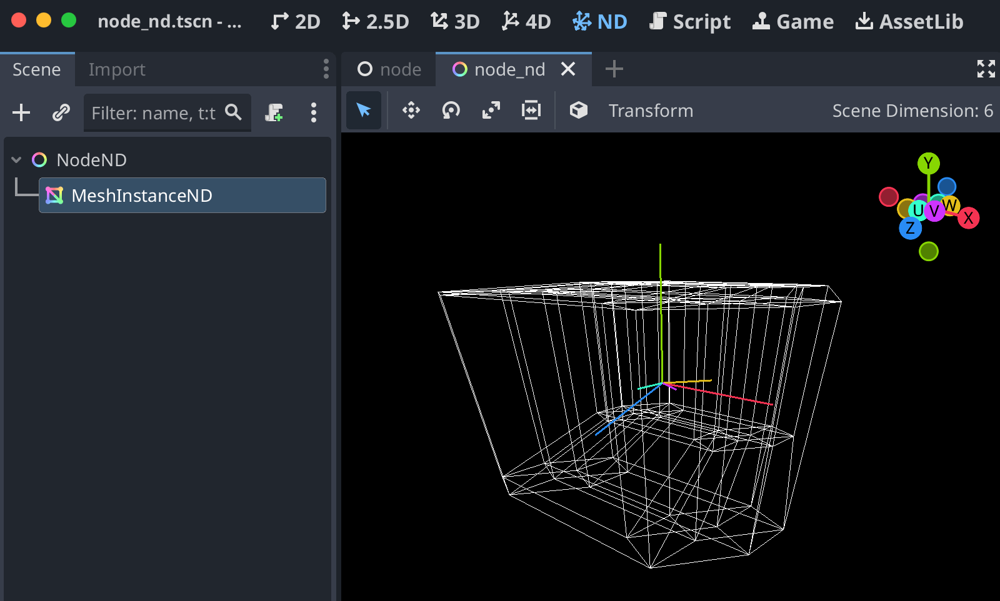

# Godot ND (N-dimensional)

NodeND and other N-dimensional types for making 5D, 6D, 7D, etc games in Godot.



Have you ever wanted to make ND games in Godot?

...no? You say you haven't? Ok, then this module isn't for you.

For anyone who does want to make an ND game, NodeND and other ND nodes now
exist, just download and compile this module, and you can make ND games in Godot!

## Installation

First, have all the Godot dependencies installed on your computer as per the
[official instructions](https://docs.godotengine.org/en/stable/contributing/development/compiling/index.html).

If you want all of the Godot Dimensions modules at once, you can grab a
branch of [our Godot fork](https://github.com/godot-dimensions/godot/tree/dimensions-latest).

```shell
git clone https://github.com/godot-dimensions/godot godot-dimensions
cd godot-dimensions
# First, make sure you can compile regular Godot.
scons
# Then, switch to the dimensions branch and download the submodules.
git switch dimensions-latest
git submodule update --init --recursive
scons
# Re-run the `scons` command to re-compile if you make changes.
```

Alternatively, if you only want ND, you can start with any clone
of Godot Engine and add this module to it:

```shell
cd modules
git clone https://github.com/godot-dimensions/godot-nd nd
# Make sure the folder is named `nd`, not `godot-nd`!
cd ..
scons
# Re-run the `scons` command to re-compile if you make changes.
```

It should now be successfully compiled, and you can run the executable in the `bin` folder.

Alternatively, Godot ND can be compiled as a GDExtension. The module approach
is recommended, but GDExtension allows you to avoid recompiling Godot.
To compile as a GDExtension, clone this repository anywhere, with submodules,
and run `scons target=editor`. You can open the repository's `project.godot`
in Godot to test the GDExtension, and copy the `addons/nd` to your own project.

## Math

- `GeometryND`: Singleton for working with ND geometry.
- `PlaneND`: Class for working with ND planes.
- `TransformND`: Class for working with ND transformations.
- `VectorND`: Singleton with math functions for VectorN (PackedFloat64Array).

## Folder Structure

- `editor/`: All editor-related classes including the ND viewport main screen tab.
- `math/`: All math-related classes including linear algebra.
- `mesh/`: All mesh-related classes including nodes and resources.
- `nodes/`: Any nodes that do not fit into other categories: NodeND and CameraND.
- `render/`: All rendering-related classes including server and engines.
- `addons/nd/`: Contains documentation, icons, and files for GDExtension.

## License

This repo is free and open source software licensed under The Unlicense.
Credit and attribution is appreciated but not required.

Some parts of some files in this repository are derivative from Godot Engine
and therefore [its MIT license](https://godotengine.org/license) applies.
You must provide credit to Godot Engine by including its LICENSE.
Considering this repo is only usable in conjunction with Godot anyway,
this will not be a problem because you should already be crediting Godot.
